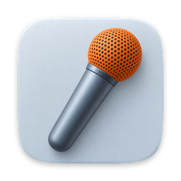
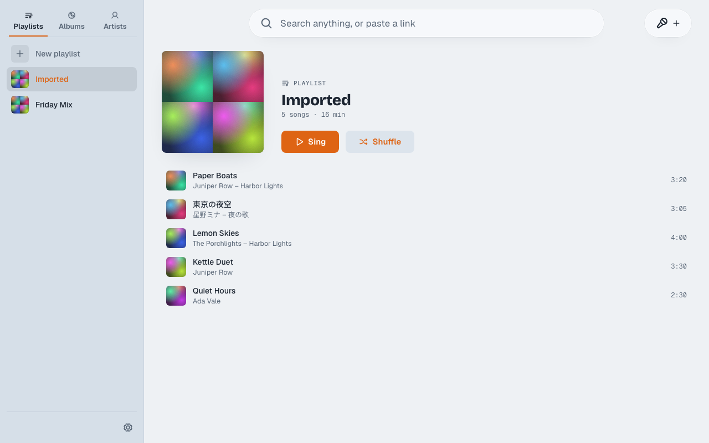
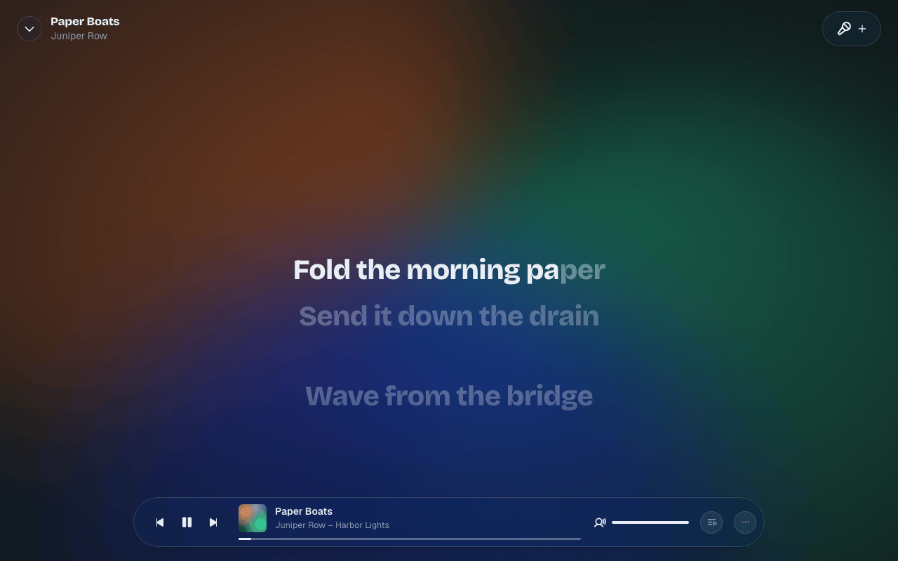
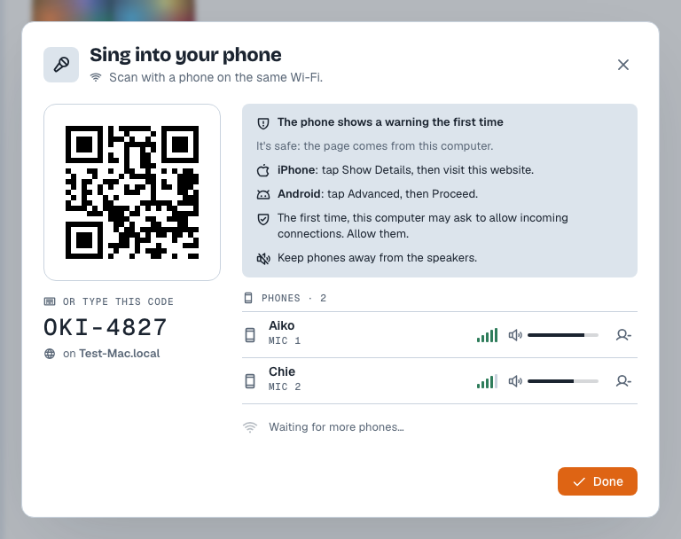
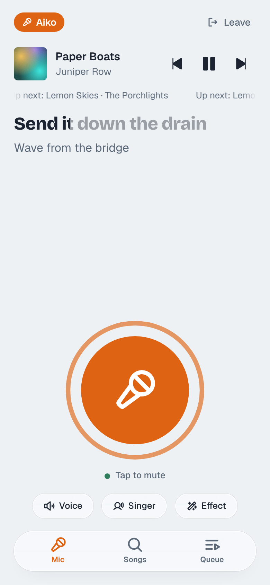

<div align="center">



# KaraAlwaysOK

**Turn any song into karaoke on your Mac, and let your friends sing into their phones.**

[](LICENSE)
[](https://github.com/MohaElder/KaraAlwaysOK/releases/latest)
-555)
[](https://github.com/MohaElder/KaraAlwaysOK/actions/workflows/ci.yml)

[Download](https://github.com/MohaElder/KaraAlwaysOK/releases/latest) · [Features](#features) · [Privacy](#privacy) · [How it works](#how-it-works)

</div>



## What is KaraAlwaysOK?

KaraAlwaysOK (卡拉永远OK / 卡拉永遠OK / カラ永遠OK) is a free, open-source karaoke app for the Mac. Pick a song, and it takes the singer's voice out and shows the lyrics word by word as the music plays. Bring songs from your own files, paste a link, or search YouTube and Bilibili right from the app.

Friends don't need a mic: they scan a QR code and sing into their phones. Everything happens on your Mac and your own Wi-Fi.



## Features

- **Vocals removed on your Mac** — take the singer out completely, or leave a little in with the singer slider
- **Key shift** — move any song up or down to fit your voice
- **Word-by-word lyrics** — lyrics light up as they're sung, line up with the song on their own, and can be nudged by hand if they're early or late
- **Search that forgives typos** — in every language, with suggestions as you type
- **Songs from anywhere** — your own audio files, a pasted link, or a YouTube or Bilibili search
- **Tidy song names** — messy video titles are turned into a proper song name and artist
- **Phone mics** — up to 4 phones become mics over your Wi-Fi: scan a QR code, no app to install
- **No howling** — a phone that starts to feed back through the speakers is turned down on its own
- **Voice effects for each guest** — Karaoke mix or Auto-tune, with a strength slider
- **Guests can run the show** — search, queue songs, play, pause, skip and read the lyrics from their phone
- **6 languages** — English, 日本語, 한국어, 简体中文, 繁體中文 and Español, following your Mac's language
- **In-app updates** — new versions install from inside the app

<table>
  <tr>
    <td></td>
    <td width="220"></td>
  </tr>
</table>

## Architecture

| Component | Path | Responsibility |
|---|---|---|
| `kara-core` | `crates/kara-core` | The Rust engine: library, adding songs from files and links, lyrics lookup and sync, vocal removal, search. No UI. |
| `kara-cli` | `crates/kara-cli` | The `kara` command line over `kara-core`, for adding, preparing and exporting songs. |
| App | `app/` | The desktop app (Tauri 2 + Svelte 5): player, singer slider, key, lyrics, and the phone mic page and server. |

## Download

Get the latest `.dmg` for **macOS on Apple Silicon** from the [Releases page](https://github.com/MohaElder/KaraAlwaysOK/releases/latest). Open it and drag KaraAlwaysOK into Applications.

**The first time you open it, macOS will block it.** KaraAlwaysOK isn't signed with an Apple Developer ID yet, so macOS says it can't check the app. To open it anyway, do one of these once:

- Open **System Settings → Privacy & Security**, scroll down and click **Open Anyway** next to KaraAlwaysOK. Or,
- In Terminal, run:
  ```bash
  xattr -dr com.apple.quarantine /Applications/KaraAlwaysOK.app
  ```

On first launch the app downloads its vocal-removal engine (about 90 MB). After that it works offline for songs you've already added.

### Recommended specs

Measured on Apple Silicon. These are guides, not hard limits; the app doesn't check your hardware.

| Setup | Song length | Peak memory | Speed |
|---|---|---|---|
| Apple Silicon, CoreML | 3–5 min | ~1.4–1.6 GB | ~45x real time |
| Apple Silicon, CoreML | 18 min | ~2.2 GB | ~45x real time |

Running on the CPU only isn't recommended: it used more than 11 GB in testing and wasn't any faster. Windows isn't supported yet.

## Build from source

**Prerequisites:** [Rust](https://rustup.rs) (stable), [Node.js](https://nodejs.org) 22, and the [Tauri prerequisites](https://v2.tauri.app/start/prerequisites/) for macOS.

```bash
# Run the desktop app in dev mode
cd app
npm install
npm run tauri:dev

# Build the app (.app and .dmg)
npm run tauri build
```

Scratch libraries, debug settings for phone mics, and the scripts that check the real app are in [docs/DEVELOPMENT.md](docs/DEVELOPMENT.md).

## Releases

Push a plain `vX.Y.Z` tag:

```bash
git tag v0.2.0
git push origin v0.2.0
```

The Release workflow runs CI first, then builds a **draft** GitHub release with the `.dmg` and `latest.json`. Publish the draft; only then does the app's update check see it.

The build needs the update signing secrets `TAURI_SIGNING_PRIVATE_KEY` and `TAURI_SIGNING_PRIVATE_KEY_PASSWORD` in the repo. They're already set.

## CLI usage

The engine also runs from the command line. From the repo root:

```bash
cargo run -p kara-cli -- add <path-or-link>          # add a file or a link to the library
cargo run -p kara-cli -- prepare <track-id> [--cpu]  # download/convert, find lyrics, remove vocals
cargo run -p kara-cli -- search <query>              # search the library
cargo run -p kara-cli -- export <track-id> <out-dir> # write vocals.wav and instrumental.wav
cargo run -p kara-cli -- bench <song> --model <onnx> # measure vocal-removal speed and memory
```

`add` takes a local audio file, a direct link to an audio file, or a page link yt-dlp can pull audio from (YouTube, Bilibili, SoundCloud, Bandcamp and more). Streaming services (Spotify, Apple Music, Tidal, Deezer) can't be downloaded and are refused with a plain message.

`prepare` downloads the vocal-removal engine on first use, then splits the song into vocals and music. Preparing the same song again is instant. `--cpu` skips CoreML.

The CLI and the app share the same library in `~/Library/Application Support/kara-always-oki` (only one can use it at a time); pass `--data <dir>` to use another folder. Run `cargo run -p kara-cli -- --help` for everything.

## How it works

1. **Adding a song.** Files are read from where they already are. Links are downloaded with [yt-dlp](https://github.com/yt-dlp/yt-dlp), which the app fetches the first time you need it.
2. **Taking the vocals out.** An AI model splits the song into the singer's voice and the music, on your Mac, using Apple's CoreML. The two parts are kept, so the singer slider can mix any amount of voice back in, and key shift works as you play.
3. **Lyrics.** The app uses lyrics built into the file, or looks them up on [LRCLIB](https://lrclib.net). Then it listens to where the singer is actually singing and slides the lyrics to match. If they're still a little off, nudge them by hand.
4. **Phone mics.** The Mac serves a small web page on your Wi-Fi. Phones open it from the QR code and send their voice straight to the Mac, which mixes it into the song and plays it through the Mac's speakers.

A few tips for phone mics:

- The first time, the phone warns that the page isn't trusted. That's expected: the page comes from your own Mac. On iPhone, tap **Show Details**, then **visit this website**. On Android, tap **Advanced**, then **Proceed**.
- macOS may ask once to allow incoming connections for KaraAlwaysOK. Allow them.
- Keep phones away from the speakers.
- Mics play through the Mac's current speakers. Bluetooth speakers and headphones add a noticeable delay.

## Privacy

KaraAlwaysOK has **no telemetry**: no analytics, no accounts, no tracking. Here's exactly what goes where:

- **Your songs, their vocal and music parts, and your lyrics stay on your Mac.** Nothing is uploaded.
- **Links and online searches** go to YouTube or Bilibili (downloads go through yt-dlp). What you type in the search box is also sent to them for suggestions. Pasting a link asks that site for its title and picture.
- **Lyrics lookups** send the song name and artist to LRCLIB.
- **Song-name checks** send guessed names to LRCLIB and MusicBrainz.
- **Phone mics stay on your Wi-Fi.** Voices go from the phones to your Mac and nowhere else.
- **Downloads from GitHub:** the vocal-removal engine, yt-dlp, and app updates.

## Roadmap

- **Apple Music library** — sing songs from your Apple Music library (planned)
- **Windows** — a Windows version
- **Smarter song names on your Mac** — tidy up song names without asking an online service

[Open an issue](https://github.com/MohaElder/KaraAlwaysOK/issues/new) to shape what's next.

## Contributing

Issues and pull requests are welcome. Before opening a PR, run the same checks CI does:

```bash
cargo test --workspace
cargo clippy --workspace --all-targets -- -D warnings
cd app
npm run check
npm run check:i18n
npm test
npx playwright test
```

The Rust tests need `ffmpeg` installed (`brew install ffmpeg`). More in [docs/DEVELOPMENT.md](docs/DEVELOPMENT.md).

## License

[MIT](LICENSE) © 2026 mohaelder
